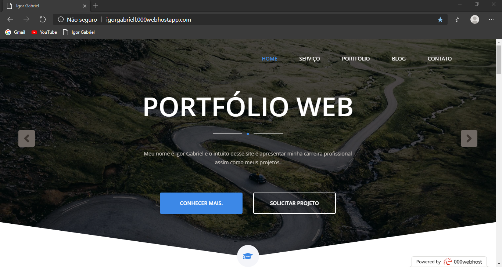
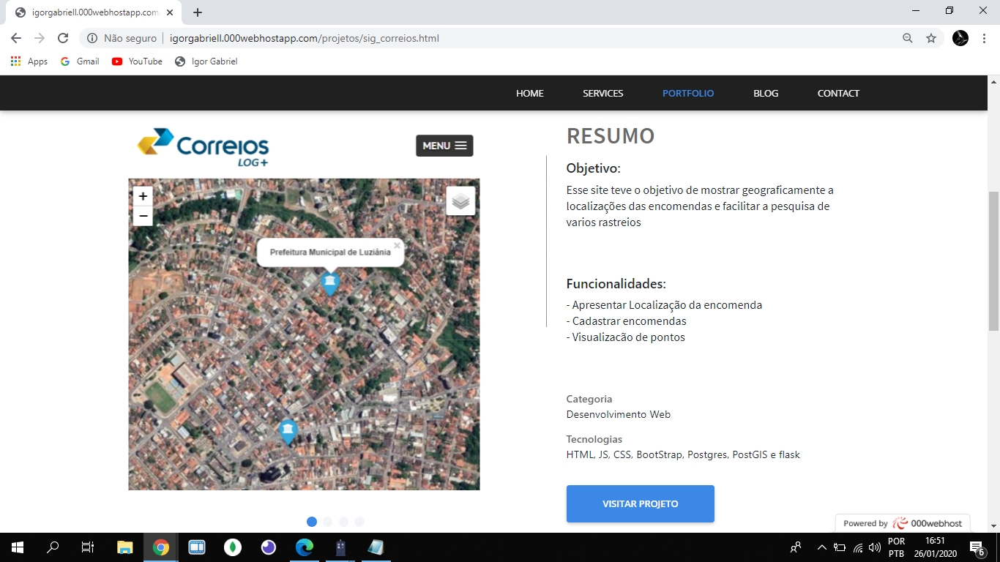
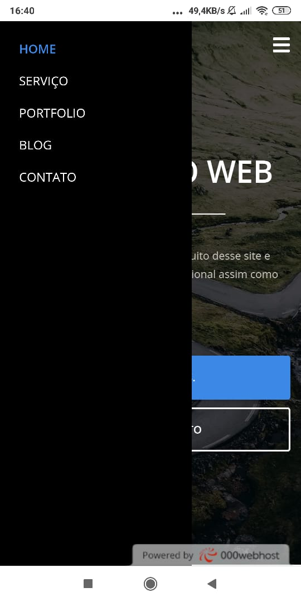
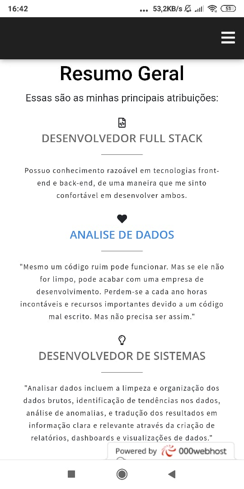

Intuito desse site e apresentar minha carreira profissional assim como meus projetos.

<h1 align="center">
    Portfólio Web
</h1>

  <a href="#projeto">Projeto</a>&nbsp;&nbsp;&nbsp;|&nbsp;&nbsp;&nbsp;
  <a href="#imagens">Imagens</a>&nbsp;&nbsp;&nbsp;|&nbsp;&nbsp;&nbsp;
  <a href="#tecnologias">Tecnologias</a>&nbsp;&nbsp;&nbsp;|&nbsp;&nbsp;&nbsp;
  <a href="#como-contribuir">Como contribuir</a>

## Projeto
Intuito desse site e apresentar minha carreira profissional assim como meus projetos.

## Imagens

- **Web**

 

- **Mobile**

&nbsp;&nbsp;&nbsp;

&nbsp;&nbsp;&nbsp;

## Tecnologias

Esse projeto foi desenvolvido com as seguintes tecnologias:

- HTML
- JS
- CSS
- [BootStrap](https://getbootstrap.com/)

## Como contribuir

- Faça um fork desse repositório;
- Cria uma branch com a sua feature: `git checkout -b minha-feature`;
- Faça commit das suas alterações: `git commit -m 'feat: Minha nova feature'`;
- Faça push para a sua branch: `git push origin minha-feature`.

Depois que o merge da sua pull request for feito, você pode deletar a sua branch.